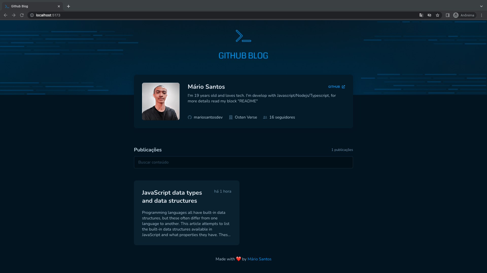
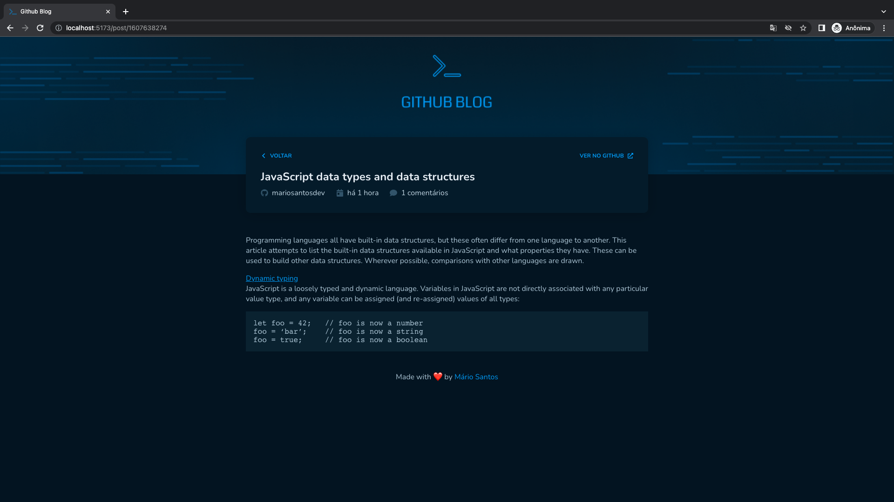

# Coffee Delivery

This project was built following the <a href="https://www.figma.com/community/file/1138814951106121051">mockup</a> created by <a href="https://github.com/rocketseat">Rocketseat</a>.

</img>
</img>

## About Project

This project is a simple blog that consume API Github, get issues from the current repository and show it as posts.
The project was developed to finish an challenge steps of the course <a href="https://www.rocketseat.com.br/ignite">Ignite</a>. I started from zero, just following the <a href="https://www.figma.com/community/file/1138814951106121051">mockup</a> already created.

## Technologies

- ViteJS
- Styled-Components
- Axios
- Luxon
- React-icons
- React-markdown
- React-router-dom